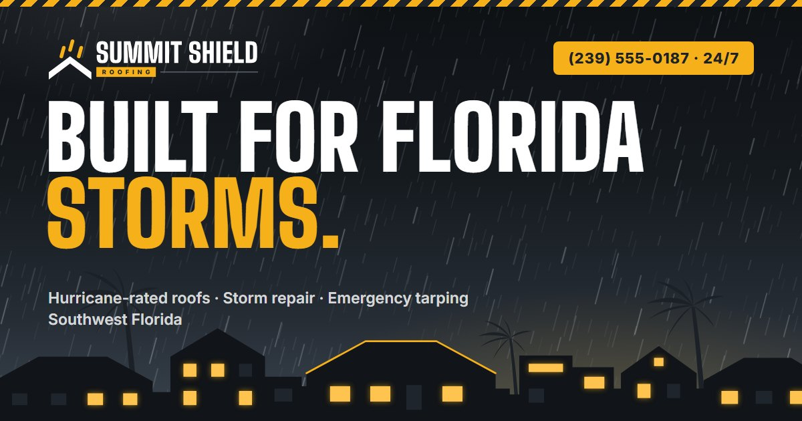

# Summit Shield Roofing

Marketing website for a Florida roofing company, built as a portfolio piece: logo, brand palette and a one-page site. Plain HTML, CSS and JavaScript, no build step and no dependencies.



## The brand

"Storm Ready": wind-driven rain stopped cold by a heavy roofline, which answers Florida's number-one roofing worry at a glance. Condensed industrial capitals and a hi-vis tag read from across the street on a truck, a yard sign or a crew shirt.

| Colour | Hex | Used for |
| --- | --- | --- |
| Graphite | `#1D2228` | Logo, header, text on yellow |
| Hi-Vis Yellow | `#F5B01A` | Buttons (8.5:1 with graphite text), accents |
| Slate | `#3A434E` | Storm sky, dark cards |
| Steel | `#8A94A0` | Meta text, icons |
| Concrete | `#EEF0F2` | Light sections |

Type: **Big Shoulders Display** Black for headings, **Inter** for body text.

Logo text is converted to vector outlines, so `images/logo.svg` renders identically anywhere, including as an `` and without the fonts installed.

## The hero

A storm sky over a street of Florida rooftops. Rain falls at the same angle as the rain in the logo, distant lightning flickers, and palms sway in the wind. The rain stops where the roofs start, and the windows glow warm underneath. One roof carries a hi-vis ridge line, the same shape as the mark. Alongside it sits the free storm inspection form. The weather pauses when the hero scrolls out of view, and visitors who prefer reduced motion get a still sky.

## Running it

Open `index.html` directly, or serve the folder:

```bash
python -m http.server 8000
```

VS Code's Live Server works too. All paths are relative to the project root.

## Structure

```
index.html          one page: hero, trust, services, storm response, process, why us, reviews, areas, FAQ, CTA
css/styles.css      tokens → base → layout → components → sections
js/main.js          mobile menu, scroll reveal, active nav link, hero pause, inspection form
images/             logo, favicons, rain texture, social share image
brand/              logo concept sheet from the exploration round
```

The nav links jump to sections on the one page; there are no separate subpages.

## About the content

The business name is real; everything else is placeholder copy for the demo. The phone number, email, service area, reviews, ratings, roof counts and claims such as "licensed & insured" and the 10-year workmanship warranty are invented and should be replaced before this is used as a live business site. The copy deliberately stays away from insurance-claim marketing, which Florida restricts for roofing contractors, and sticks to storm damage repair and free inspections. The inspection form validates and shows a confirmation, but sends nothing: there's a marked spot in `js/main.js` for connecting a form service.
